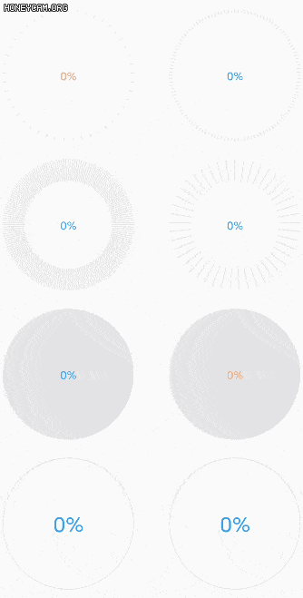

# CircleProgress
Customizable circular progress bar

Step 1. Add it in your root build.gradle at the end of repositories:

	allprojects {
		repositories {
			...
			maven { url 'https://jitpack.io' }
		}
	}
Step 2. Add the dependency

	dependencies {
	        implementation 'com.github.quibbler01:CircleProgress:1.0.1'
	}

Step 3. Add SwitchButton in your layout xml:

    <cn.quibbler.circleprogress.CircleProgress
        android:id="@+id/circle_progress"
        android:layout_width="match_parent"
        android:layout_height="match_parent" />

Step 4. Use it in your way.

        //find this SwitchButton
        val circleProgress = binding.circleProgress
